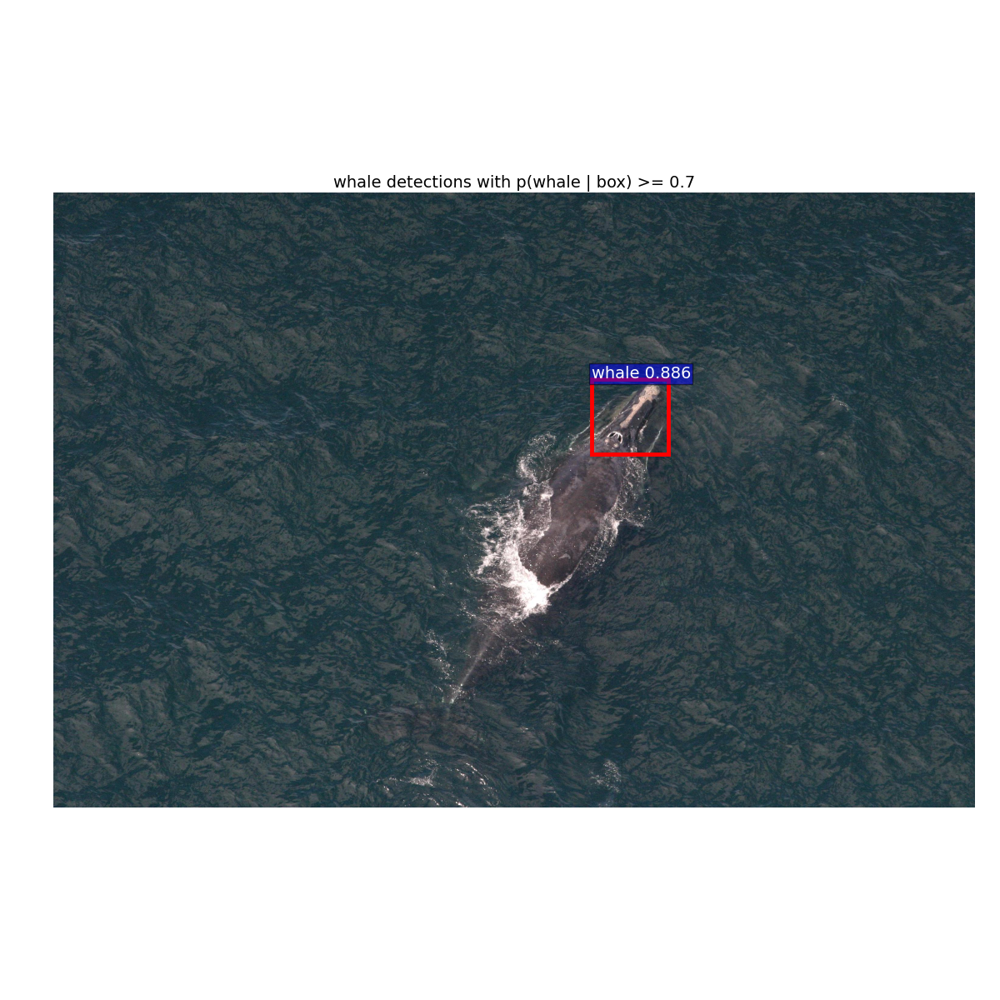
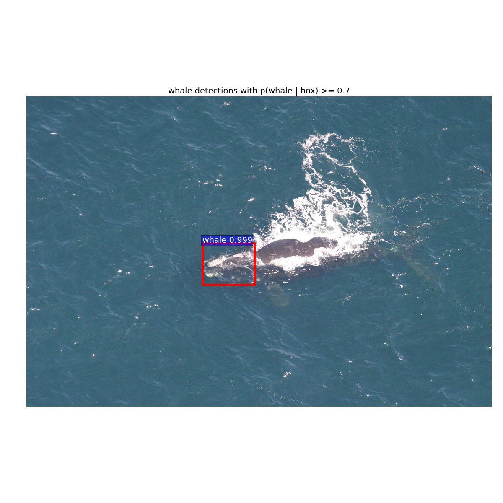

## Preparing Dataset
You may want to compare with similar steps listed on [Train Fast-RCNN on Another Dataset](https://github.com/zeyuanxy/fast-rcnn/tree/master/help/train) and [How to train fast rcnn on imagenet](http://sunshineatnoon.github.io/Train-fast-rcnn-model-on-imagenet-without-matlab/). Below is my dataset directory:
```


## Demo
<tr>
<td>


</td>
</tr>


```


